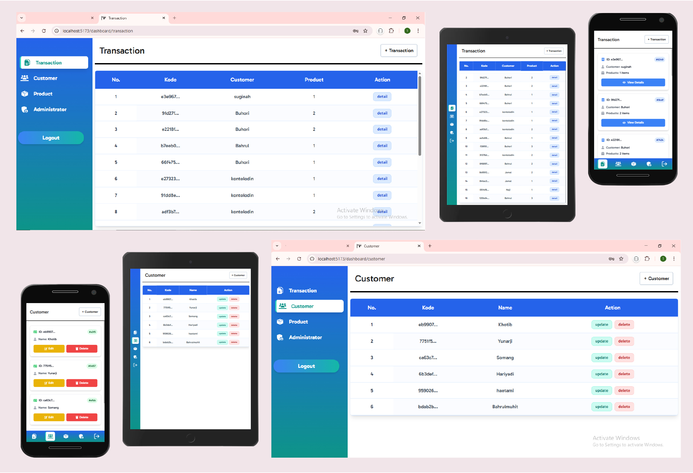

## Backend -> [here](https://github.com/THaetami/express-prisma-react-fullstack/tree/laundry-rest-api/src)

### Setup

Make sure to install the dependencies:

```bash
# npm
npm install

# pnpm
pnpm install

# yarn
yarn install

# bun
bun install
```

### Development Server

Start the development server on `http://localhost:3000`:

```bash
# npm
npm run dev

# pnpm
pnpm run dev

# yarn
yarn dev

# bun
bun run dev
```

### Production

Build the application for production:

```bash
# npm
npm run build

# pnpm
pnpm run build

# yarn
yarn build

# bun
bun run build
```

<br>

<div align="center">
  
</div>

<br>

<div align="center">
  
</div>

<br>

<div align="center">
  
</div>
